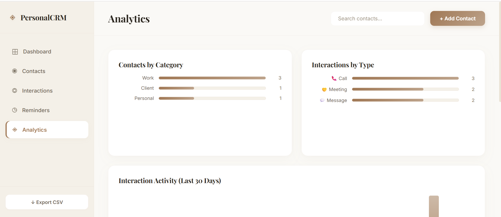
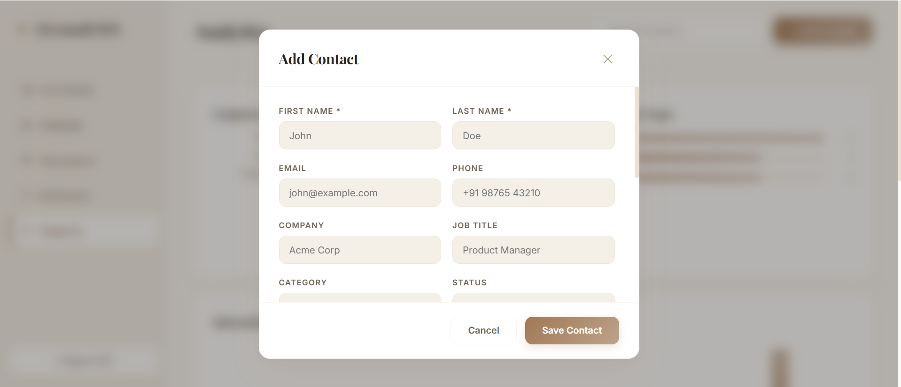
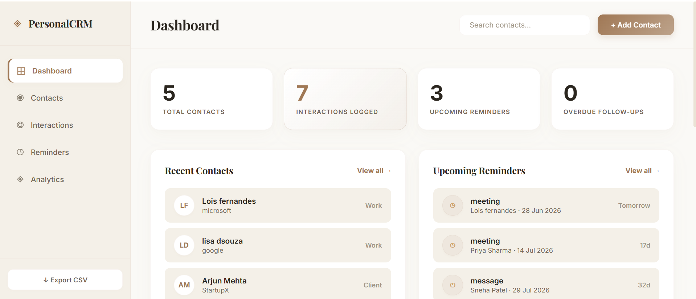
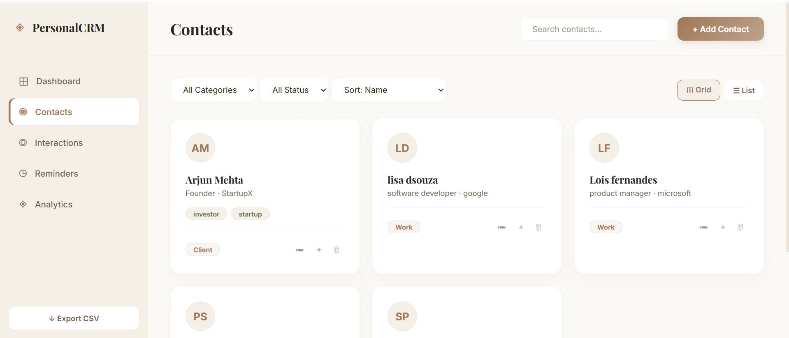
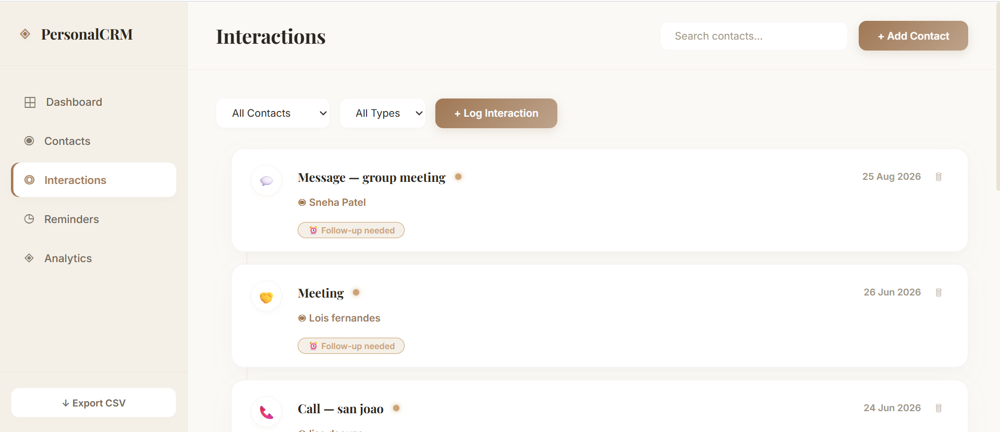
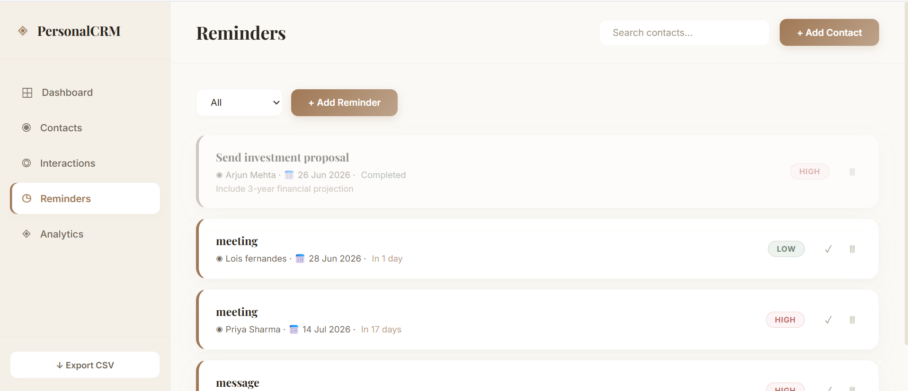

# Personal CRM System

> **CODTECH Internship Project — Task 1**

## Project Info

Intern ID
<<<<<<< HEAD
Full Name
No. of Weeks
Project Name Personal CRM System 
Domain
=======
Full Name: Erika Fernandes
No. of Weeks: 6 weeks
Project Name: Personal CRM System 
Domain: Software Engineering
>>>>>>> 3d9999354beddc1c70163ddd4d89058e0fbc5b2d
Tech Stack** | HTML5, CSS3, Vanilla JavaScript, localStorage |

## Project Scope

A **Personal Contact Relationship Manager (CRM)** built as a fully client-side web application. It allows users to manage personal and professional contacts, track interactions, set follow-up reminders, and analyze networking patterns — all stored locally in the browser.

---

## Features

###  Contact Management
- Add, edit, delete contacts
- Categorize: Work, Personal, Family, Client, Other
- Tags, birthday, company, job title, social links
- Grid & List view with sorting and filtering
- One-click contact detail popup

###  Interaction Logging
- Log calls, emails, meetings, messages
- Sentiment tracking (Positive / Neutral / Negative)
- Follow-up flags
- Chronological timeline view with filters

### Reminder System
<<<<<<< HEAD
- Set dated reminders linked to contacts
- Priority levels: High / Medium / Low
=======
- Set dated reminders linked to contacts- Priority levels: High / Medium / Low
>>>>>>> 3d9999354beddc1c70163ddd4d89058e0fbc5b2d
- Overdue detection with visual alerts
- Mark reminders as complete

### Analytics Dashboard
- Contacts by category bar chart
- Interactions by type chart
- 30-day activity chart
- Top 5 most-engaged contacts
- Contacts needing attention (30+ days no contact)

### Other Features
- Global search across all contacts
- Export contacts to CSV
- Stats at a glance (dashboard)
- LocalStorage persistence (data saved in browser)
- Responsive design (mobile friendly)
- Dark theme UI

<<<<<<< HEAD

## Screenshots

=======
>>>>>>> 3d9999354beddc1c70163ddd4d89058e0fbc5b2d
